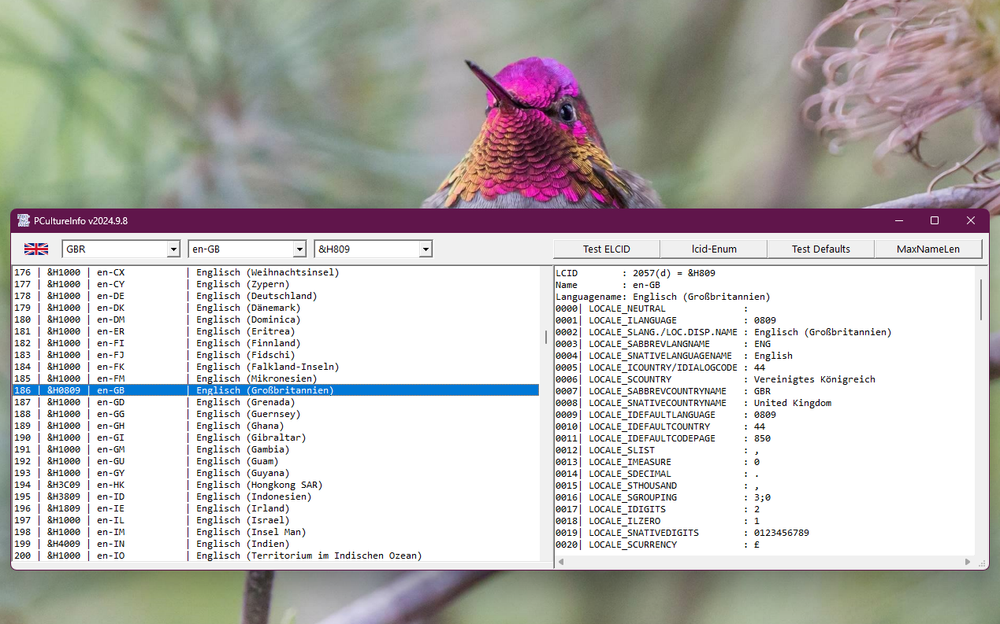

# Glob_CultureInfo  
## Lists All CultureInfos And All Infos Of One Culture  

Project started in spring 2006.  
Lists all language IDs (LCID)  

some links:  
[VB 5/6-Tipp 0733: list all languages](http://www.activevb.de/tipps/vb6tipps/tipp0733.html)  
[VB 5/6 Tippvorschlag 0055: LCID in RFC1766-Zeichenfolge umwandeln](http://www.activevb.de/cgi-bin/tippupload/show/55/LCID_in_RFC1766_Zeichenfolge_umwandeln)  
[Windows Language Code Identifier (LCID) Reference](https://docs.microsoft.com/de-de/openspecs/windows_protocols/ms-lcid/70feba9f-294e-491e-b6eb-56532684c37f)  
[Sprachbezeichnerkonstanten und Zeichenfolgen](https://docs.microsoft.com/de-de/windows/win32/intl/language-identifier-constants-and-strings)  
[Language-statement](https://docs.microsoft.com/de-de/windows/win32/menurc/language-statement)  

